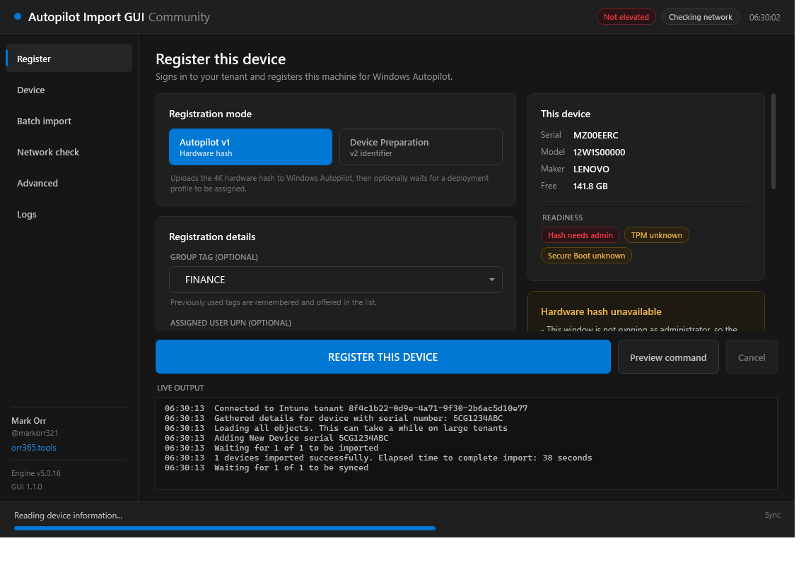
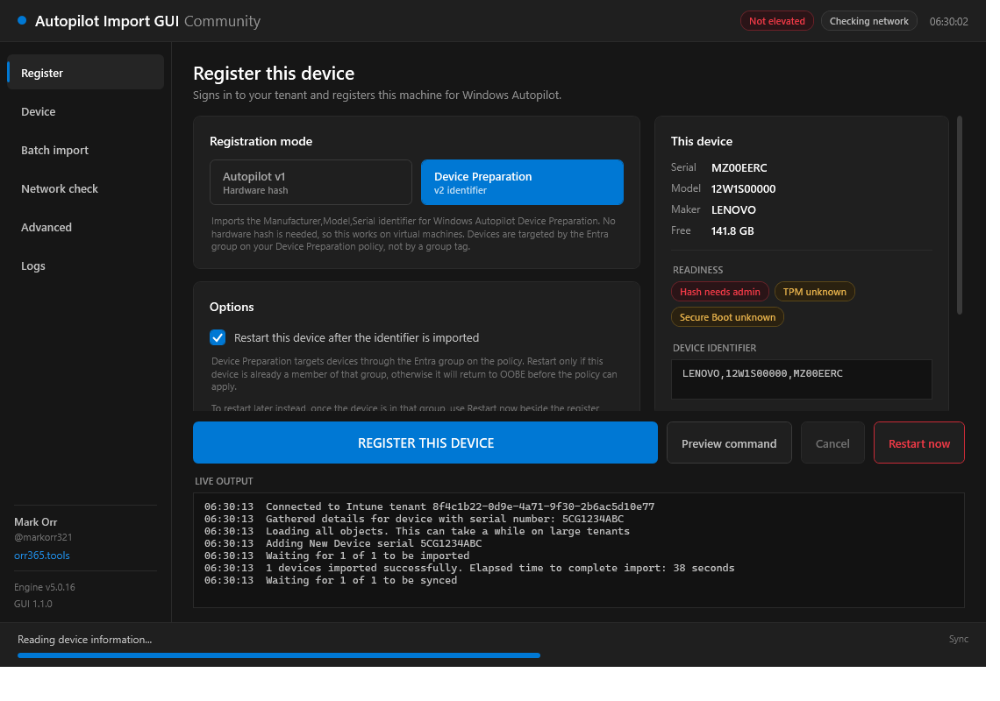
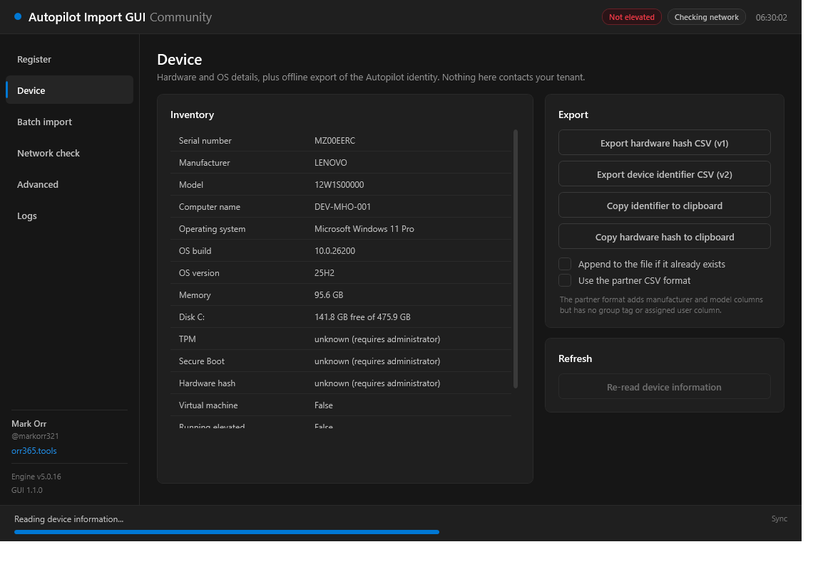
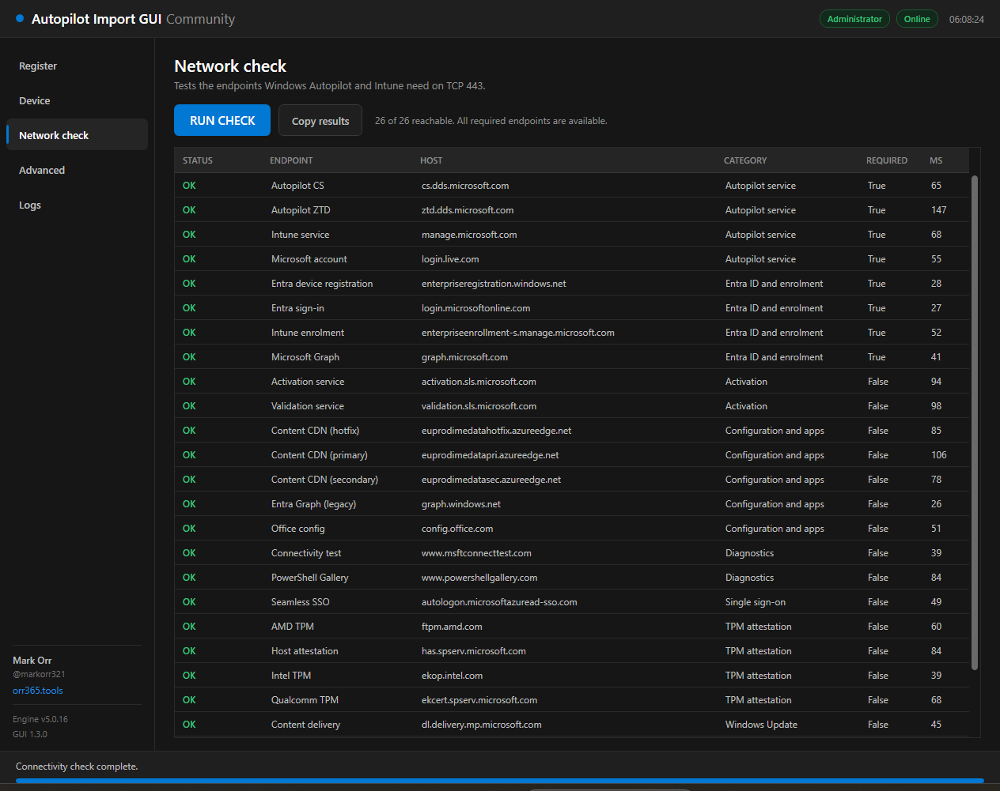
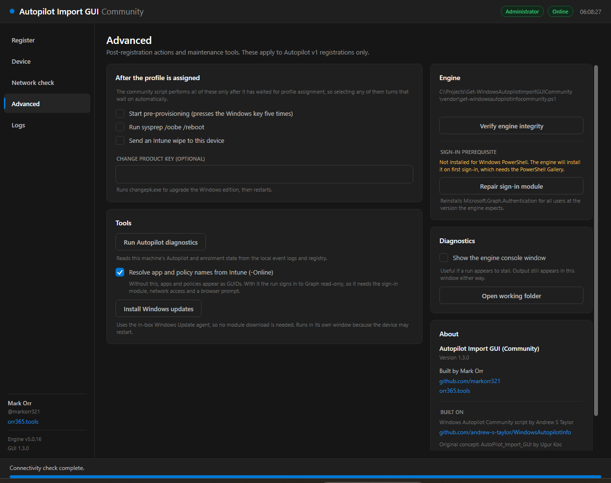
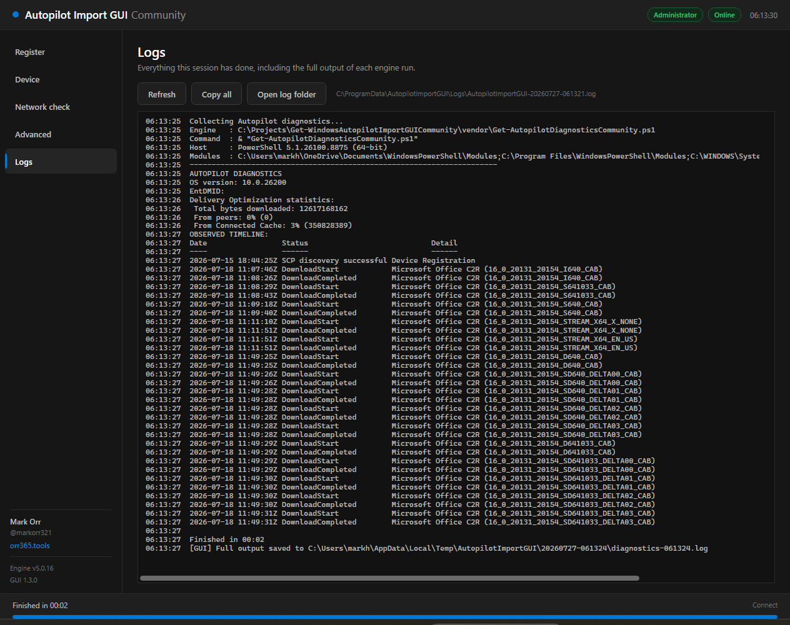

# Autopilot Import GUI (Community)

**by [Mark Orr](https://github.com/markorr321) · [orr365.tools](https://orr365.tools)**

A graphical front end for [Andrew S Taylor's Windows Autopilot Community script](https://github.com/andrew-s-taylor/WindowsAutopilotInfo), supporting **both Autopilot v1 (hardware hash) and Autopilot v2 (Device Preparation identifiers)**.

It is a ground-up rewrite of [ugurkocde/AutoPilot_Import_GUI](https://github.com/ugurkocde/AutoPilot_Import_GUI), which wrapped Michael Niehaus' original `Get-WindowsAutoPilotInfo` and therefore supported v1 only.



---

## Why a rewrite

| | Original GUI | This tool |
|---|---|---|
| Engine | `Get-WindowsAutoPilotInfo` (v1 only) | `get-windowsautopilotinfocommunity.ps1` v5.0.16 (**v1 + v2**) |
| Window | Fixed 399×636, absolute pixel positioning | Resizable, `Grid`-based, sidebar navigation |
| Feedback | Spawns separate console windows | Output streamed into the window with **staged progress** and a **cancel** button |
| Network check | Present but **never worked** — every probe called `Write-Output -ForegroundColor`, which is not a valid parameter, so all 29 checks threw and the errors were swallowed by `SilentlyContinue` | Rewritten: 26 endpoints probed concurrently in ~0.4 s, colour-coded results grid, latency, required vs optional |
| Group tag | Free-text box, retyped every time | Editable dropdown with remembered history |
| Already-registered device | Not handled — the engine's `Read-Host` prompt would hang behind the console | Explicit choice: update tag / delete and re-add / assume new |
| Also supports | — | Assigned user, computer name, Entra group membership, offline export, wipe, sysprep, pre-provisioning, product key change, Autopilot diagnostics (local, or with Intune name resolution) |
| Logging | `C:\Autopilot_Import_GUI_log.txt` | `%ProgramData%\AutopilotImportGUI\Logs\` with an in-app Logs page |
| Windows Update | Downloads the `PSWindowsUpdate` module from PSGallery | Uses the in-box Windows Update agent, so it works on a restricted OOBE network |

---

## Autopilot v1 vs v2

The mode toggle is not cosmetic — the two paths are mutually exclusive in the engine.

**Autopilot v1** uploads the 4K hardware hash to `windowsAutopilotDeviceIdentities`. Group tag, assigned user, computer name, Entra group and profile-assignment waiting all apply. Requires administrator rights, and many virtual machines cannot produce a hash at all.

**Autopilot v2 (Device Preparation)** imports a `Manufacturer,Model,Serial` identifier to `importedDeviceIdentities`. No hardware hash is needed, so it works on VMs. Devices are targeted by the **Entra security group on your Device Preparation policy**, not by a group tag — so group tag, assigned user, computer name, Entra group and assignment waiting do not apply, and the whole Registration details card is hidden in this mode rather than shown dimmed.

v2 gets its own restart controls, because the engine cannot provide them — its `-Reboot` only runs inside the assignment wait that the identifier path never reaches. The GUI performs the restart itself:

- **Restart now** — a button beside Register. Usually what you want: import the identifier, add the device to the policy's Entra group, then come back and press it.
- **Restart this device after the identifier is imported** — a checkbox, for when the device is already in that group. Fires only on a clean run, never after a failure or a cancel.

Either way, restart only once the device is a member of the Entra group targeted by your Device Preparation policy; otherwise it returns to OOBE before the policy can apply.



If this machine cannot produce a hardware hash, the tool defaults to v2 and says why.

---

## Requirements

- Windows 10/11, **Windows PowerShell 5.1** (not PowerShell 7 — the engine pins `Microsoft.Graph.Authentication` to ≤ 2.9.1)
- Administrator rights (the hardware hash lives in a CIM class that standard users cannot read)
- An account that can register Autopilot devices in your tenant

The engine requests these delegated Graph scopes on first sign-in:

```
Device.ReadWrite.All
DeviceManagementManagedDevices.ReadWrite.All
DeviceManagementServiceConfig.ReadWrite.All
DeviceManagementScripts.ReadWrite.All
Group.ReadWrite.All            (only when adding to an Entra group)
GroupMember.ReadWrite.All      (only when adding to an Entra group)
```

Diagnostics run entirely locally by default. Only if you tick **Resolve app and policy names from Intune** does that page sign in, and then read-only:

```
DeviceManagementApps.Read.All
DeviceManagementConfiguration.Read.All
```

Does not work in **WinPE** (no WPF). It does work in full Windows **OOBE** via <kbd>Shift</kbd>+<kbd>F10</kbd>.

---

## Install from the PowerShell Gallery

[](https://www.powershellgallery.com/packages/Get-WindowsAutopilotImportGUICommunity)
[](https://www.powershellgallery.com/packages/Get-WindowsAutopilotImportGUICommunity)

```powershell
Install-Script -Name Get-WindowsAutopilotImportGUICommunity -Scope AllUsers -Force
Get-WindowsAutopilotImportGUICommunity.ps1
```

`Install-Script` puts it in `C:\Program Files\WindowsPowerShell\Scripts`, which is on `PATH`.

On a **fresh VM** the Gallery itself usually needs bootstrapping first — a clean Windows image
has no NuGet provider and treats PSGallery as untrusted, and those prompts are easy to miss:

```powershell
[Net.ServicePointManager]::SecurityProtocol = [Net.SecurityProtocolType]::Tls12
Install-PackageProvider -Name NuGet -MinimumVersion 2.8.5.201 -Force
Set-PSRepository -Name PSGallery -InstallationPolicy Trusted
Install-Script -Name Get-WindowsAutopilotImportGUICommunity -Scope AllUsers -Force
```

> Run all of this in **Windows PowerShell 5.1** (`powershell.exe`), not PowerShell 7. Launching
> from a PS7 terminal leaks PS7's `PSModulePath` into child processes; the tool corrects for
> that, but 5.1 avoids the problem entirely.

A VM is a good test target precisely because most VMs cannot produce a hardware hash, so the
tool detects that and defaults to **Device Preparation (v2)**, which does not need one.

## Quick start

Everything is embedded in one file — the window, the theme, and the engine itself. Copy `dist\Get-WindowsAutopilotImportGUICommunity.ps1` to a USB stick and run it:

```powershell
powershell.exe -ExecutionPolicy Bypass -File .\Get-WindowsAutopilotImportGUICommunity.ps1
```

In OOBE, press <kbd>Shift</kbd>+<kbd>F10</kbd>, then:

```cmd
powershell -ExecutionPolicy Bypass -File D:\Get-WindowsAutopilotImportGUICommunity.ps1
```

Optional parameters:

```powershell
# Pre-fill the group tag and start in v1 mode
.\Get-WindowsAutopilotImportGUICommunity.ps1 -GroupTag FINANCE -Mode v1

# Device preparation, pre-filled assigned user
.\Get-WindowsAutopilotImportGUICommunity.ps1 -Mode v2 -AssignedUser user@contoso.com

# Skip the elevation prompt (hash will be unavailable)
.\Get-WindowsAutopilotImportGUICommunity.ps1 -NoElevate
```

The tool elevates itself once at launch, so child engine runs inherit the token and the technician sees a single UAC prompt per session.

---

## What each page does

### Register
Mode toggle, group tag (with history, hidden in Device Preparation mode), assigned user, computer name, Entra group, and the options that matter. **Preview command** renders the exact engine invocation without running anything — useful for verifying behaviour and for lifting into your own automation.

Destructive combinations (delete-and-re-add, wipe, sysprep, product key change) require explicit confirmation showing the command that will run.

### Device
Full inventory, plus offline export that never touches your tenant: hardware hash CSV (v1), device identifier CSV (v2), partner CSV format, and clipboard copies.



### Network check
Probes the documented Autopilot, Intune, Entra, TPM attestation, activation and update endpoints on TCP 443, concurrently. Failures sort to the top; required failures are red, optional ones amber.



### Advanced
Post-assignment actions (pre-provisioning, sysprep, wipe, product key), Autopilot diagnostics, Windows Update, engine integrity verification, and a toggle to show the engine console.

Diagnostics reads this machine's ESP and enrolment state from the local event logs and registry. Tick **Resolve app and policy names from Intune** to add the script's `-Online` lookup, which signs in to Graph read-only (`DeviceManagementApps.Read.All`, `DeviceManagementConfiguration.Read.All`) and turns app, policy and script GUIDs into display names. It is off by default so the local read stays usable in OOBE, with no sign-in module and no browser prompt; the choice is remembered.



### Logs
The whole session, including the full output of each engine run, with the log file path and a copy button. Engine output is rendered through the formatter, so tabular sections such as the diagnostics **observed timeline** arrive as readable tables rather than object type names, and each run also writes a standalone log file whose path is reported at the end.

A finished run stays on screen until you press **Refresh**, and both scrollbars work, so a long report can actually be read.



---

## Configuration

`config.json` is read from next to the script first, then `%ProgramData%\AutopilotImportGUI\`. Ship a preconfigured one on your USB stick to pre-populate site group tags:

```json
{
  "groupTagHistory": ["FINANCE", "KIOSK-EU", "LAB-VDI"],
  "lastMode": "v1",
  "waitForAssignment": true,
  "rebootWhenAssigned": true,
  "existingDevicePolicy": "update",
  "showConsoleWindow": false,
  "diagnosticsOnline": false,
  "connectivityEndpoints": null
}
```

`existingDevicePolicy` is `update`, `delete` or `skipcheck`. Set `connectivityEndpoints` to an array of `{ Category, Name, Host, Port, Required }` to replace the built-in endpoint list. Set `diagnosticsOnline` to `true` to have the Advanced page's diagnostics run default to `-Online`.

---

## Building from source

```powershell
.\build.ps1                        # runs tests, then emits dist\*.ps1
.\build.ps1 -SkipTests             # skip the Pester gate
.\build.ps1 -UpdateVendorManifest  # after refreshing vendor\ from upstream
```

### Publishing

```powershell
# Windows PowerShell 5.1 only: Publish-Script is PowerShellGet v2.
powershell.exe -File .\publish.ps1 -WhatIf          # validate everything, upload nothing
powershell.exe -File .\publish.ps1 -ApiKey 'oy2...' # publish
```

`publish.ps1` refuses to upload unless the build is current: it re-runs the distribution smoke
test, checks that `dist` is newer than everything in `src\` and `vendor\`, confirms the built
version matches `$script:ApAppVersion` in the sources, and verifies the version is newer than
what is already on the Gallery. A published version can only be unlisted, never replaced, so
these checks run before anything is sent.

To release a new version, bump `$script:ApAppVersion` in
[src\Public\Show-AutopilotImportGui.ps1](src/Public/Show-AutopilotImportGui.ps1) — the build
reads it and stamps `PSScriptInfo`, the About card and the sidebar from that one place.

The build inlines both XAML documents and embeds each vendored script as base64 of its **exact bytes** — never re-encoded text — so Andrew Taylor's Authenticode signature survives. The checksum is round-trip verified at build time and again at runtime.

### Layout

```
Get-WindowsAutopilotImportGUICommunity.ps1   development entry point (dot-sources src\)
build.ps1                                    -> dist\ single self-contained script
src\Views\MainWindow.xaml                    window; @THEME@ token receives the theme
src\Themes\Dark.xaml                         palette and control templates
src\Private\ArgumentBuilder.ps1              UI state -> engine parameters (pure, tested)
src\Private\ProgressParser.ps1               engine output -> progress state (pure, tested)
src\Private\ScriptRunner.ps1                 child process, live log tail, cancel
src\Private\Connectivity.ps1                 endpoint list + concurrent probes
src\Public\Show-AutopilotImportGui.ps1       window construction and wiring
vendor\                                      pinned community scripts + VERSION.json
```

### Tests

```powershell
Invoke-Pester .\tests                                                   # 75 unit tests
powershell.exe -STA -ExecutionPolicy Bypass -File tests\Test-Distribution.ps1   # 29 build checks
```

`build.ps1` runs the unit tests and refuses to produce a build if any fail.

The unit tests pin down three engine behaviours that otherwise fail *silently* — see `src\Private\ArgumentBuilder.ps1` for the full reasoning:

1. `-Reboot`, `-Wipe`, `-Sysprep`, `-preprov` and `-ChangePK` are nested inside `if ($Assign)`, so without `-Assign` they never execute. The builder forces `-Assign` on.
2. An already-registered serial with neither `-delete` nor `-updatetag` hits a `Read-Host` prompt — fatal behind a hidden console. The builder always emits an explicit policy plus `-Force`.
3. `-identifier` takes a separate code path that ignores group tag, assigned user, computer name, Entra group, assign and reboot.

`Test-Distribution.ps1` additionally proves the embedded engine still reports a **Valid** Authenticode signature after the base64 round-trip.

---

## Credits

- **Author:** Mark Orr — [@markorr321](https://github.com/markorr321) · [orr365.tools](https://orr365.tools)
- **Engine:** [`get-windowsautopilotinfocommunity.ps1`](https://github.com/andrew-s-taylor/WindowsAutopilotInfo) and `Get-AutopilotDiagnosticsCommunity.ps1` © Andrew S Taylor, MIT. Vendored unmodified; see `vendor\VERSION.json` for the pinned commit and checksums.
- **Original concept:** [AutoPilot_Import_GUI](https://github.com/ugurkocde/AutoPilot_Import_GUI) © 2023 Ugur Koc, MIT. No code from it is redistributed here.
- The community script itself derives from Microsoft's `Get-WindowsAutoPilotInfo` by Michael Niehaus.

MIT licensed — see [LICENSE](LICENSE).
